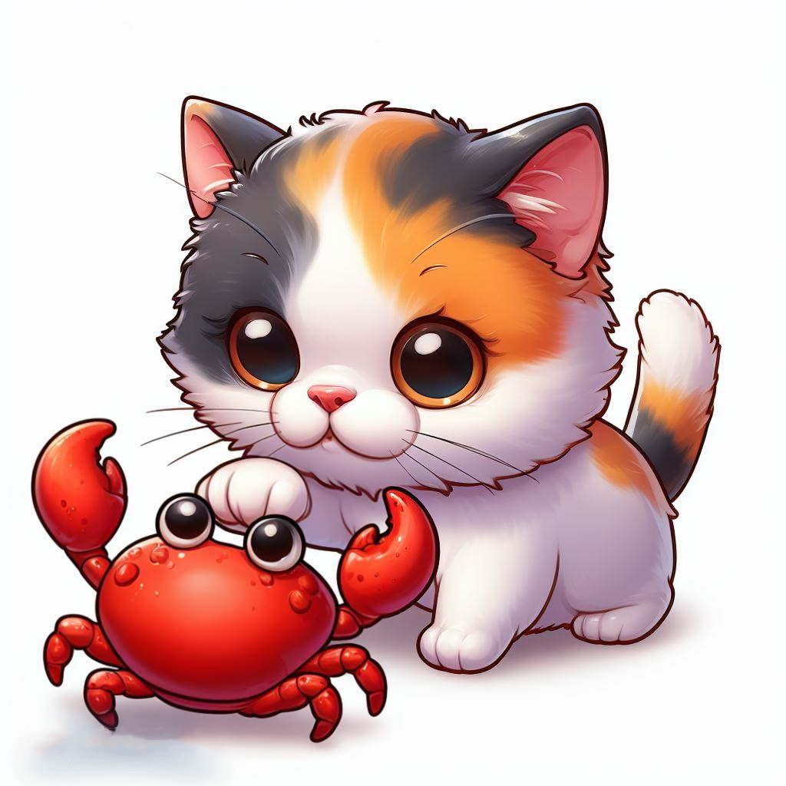

# meow

> Sweet cats always meow~ back.
>
> &emsp;&emsp;&emsp;&emsp;&emsp;&emsp;&emsp;&emsp;&emsp;&emsp;&emsp;&emsp;&emsp;&emsp;--沃兹基 • 硕德

用 Rust 实现的高性能 HTTP 服务器，用于返回访问者 IP。



## 编译方法

```bash
# 获取 meow
git clone https://github.com/Cookie-Cats/meow.git

# 编译
cd meow
cargo build --release

# 运行
./target/release/meow --help
```

## 用法

```bash
./meow --help         
Sweet cats always meow~ back.

Usage: meow [OPTIONS]

Options:
  -l, --listen <0.0.0.0:8080>  
  -h, --help                   Print help
  -V, --version                Print version
 
# 在 127.0.0.1 的 8080 端口开放 HTTP 服务器
./meow -l 127.0.0.1:8080

# 如果不加-l参数，或输入格式错误，则默认监听 0.0.0.0:8080
./meow

# 返回值
curl --raw http://localhost:8080
127.0.0.1\n
```

**警告⚠️：如无法获取发送者 IP，则会返回 0.0.0.0**。

## 许可证

```
MIT License

Copyright (c) 2023 Cookie-Cats

Permission is hereby granted, free of charge, to any person obtaining a copy
of this software and associated documentation files (the "Software"), to deal
in the Software without restriction, including without limitation the rights
to use, copy, modify, merge, publish, distribute, sublicense, and/or sell
copies of the Software, and to permit persons to whom the Software is
furnished to do so, subject to the following conditions:

The above copyright notice and this permission notice shall be included in all
copies or substantial portions of the Software.

THE SOFTWARE IS PROVIDED "AS IS", WITHOUT WARRANTY OF ANY KIND, EXPRESS OR
IMPLIED, INCLUDING BUT NOT LIMITED TO THE WARRANTIES OF MERCHANTABILITY,
FITNESS FOR A PARTICULAR PURPOSE AND NONINFRINGEMENT. IN NO EVENT SHALL THE
AUTHORS OR COPYRIGHT HOLDERS BE LIABLE FOR ANY CLAIM, DAMAGES OR OTHER
LIABILITY, WHETHER IN AN ACTION OF CONTRACT, TORT OR OTHERWISE, ARISING FROM,
OUT OF OR IN CONNECTION WITH THE SOFTWARE OR THE USE OR OTHER DEALINGS IN THE
SOFTWARE.
```

**Made with Love❤️ by 77 and QiQi**.
